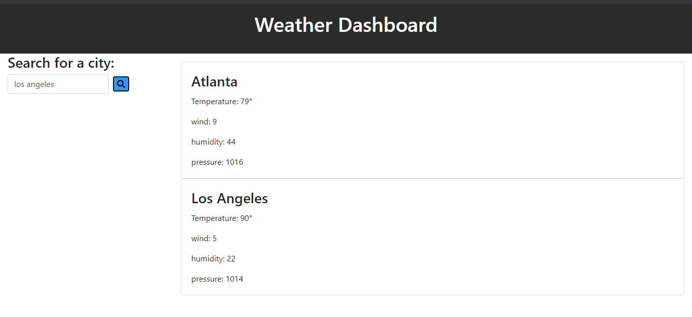

# weather-dashboard

Project Title weather-dashboard

summary:

The weather-dashboard was a project that tasked me with retrieving data from the openweathermap.org api to display in a weather dashboard application.
The weather dashboard was to allow a user to input a city into a search box that would retrieve the current weather conditions for the city that was entered.
the project was to follow the following acceptance criteria. 


GIVEN a weather dashboard with form inputs
WHEN I search for a city
THEN I am presented with current and future conditions for that city and that city is added to the search history
WHEN I view current weather conditions for that city
THEN I am presented with the city name, the date, an icon representation of weather conditions, the temperature, the humidity, the wind speed, and the UV index
WHEN I view the UV index
THEN I am presented with a color that indicates whether the conditions are favorable, moderate, or severe
WHEN I view future weather conditions for that city
THEN I am presented with a 5-day forecast that displays the date, an icon representation of weather conditions, the temperature, and the humidity
WHEN I click on a city in the search history
THEN I am again presented with current and future conditions for that city
WHEN I open the weather dashboard
THEN I am presented with the last searched city forecast
```


Project Notes:
The weather dashboard was a challenging project and I was able to meet much of the acceptance criteria but I missed the mark on checking off all the acceptance criteria.
I simply ran out  of time and I couldn't get the 5 day forecast to display. However, I was able to display the current weather conditions and the previous cities searched

Link to the site

https://scottpwells.github.io/weather-dashboard/

Please see screen shot of app below

